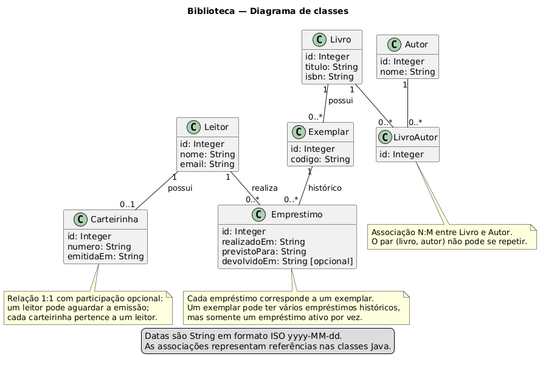
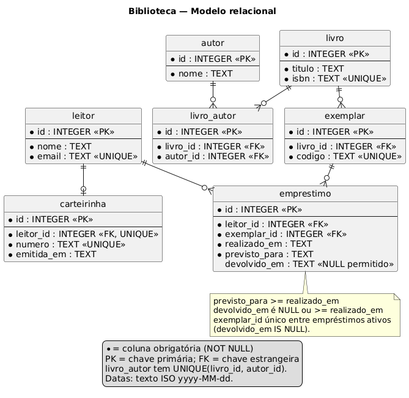

# Biblioteca — Atividade0909

Camada de persistência de um sistema de gerenciamento de bibliotecas, desenvolvida em **Java 17+**, **ORMLite 6.1** e **SQLite**. O recorte contempla catálogo, autoria, exemplares físicos, leitores, carteirinhas e circulação de exemplares.

## Artefatos da atividade

| Entrega | Arquivos |
|---|---|
| Diagrama de classes | [Fonte PlantUML](diagramas/classes.puml) e [imagem](diagramas/classes.png) |
| Diagrama E-R | [Fonte PlantUML](diagramas/er.puml) e [imagem](diagramas/er.png) |
| Camada de persistência | [Classes Java](src/main/java/br/edu/biblioteca), [esquema SQL](src/main/resources/schema.sql) e [dependências Maven](pom.xml) |
| Testes interativos | [Notebook Jupyter](notebooks/testes_persistencia.ipynb) |
| Validação complementar | [Teste de integração JUnit](src/test/java/br/edu/biblioteca/PersistenciaTest.java) |

## Regras e modelagem

- **Leitor–Carteirinha (1:1):** um leitor pode ainda não ter carteirinha, mas pode ter no máximo uma. Toda carteirinha pertence a exatamente um leitor. A chave estrangeira `carteirinha.leitor_id` é obrigatória e única.
- **Livro–Exemplar (1:N):** o livro representa a obra/edição; o exemplar representa uma cópia física identificada por código único. Um livro pode ser cadastrado antes da aquisição de cópias.
- **Livro–Autor (N:M):** uma obra pode ter vários autores e cada autor pode participar de várias obras. `LivroAutor` implementa essa associação. A tabela possui ID próprio e uma restrição `UNIQUE(livro_id, autor_id)` contra vínculos repetidos. O catálogo permite cadastrar livros antes de informar a autoria.
- **Leitor–Empréstimo e Exemplar–Empréstimo (1:N):** cada empréstimo corresponde a um leitor e um exemplar. Retirar três exemplares gera três empréstimos.
- Um exemplar pode ter vários empréstimos no histórico, mas apenas um ativo. Um índice único parcial no SQLite garante essa regra inclusive em inserções feitas diretamente pelo DAO.
- A devolução preenche a data e preserva o histórico. O prazo e a devolução não podem ser anteriores ao início do empréstimo.
- A exclusão de registros referenciados é bloqueada por chaves estrangeiras; não há exclusão em cascata do histórico.

O diagrama de classes apresenta a N:M já resolvida pela classe associativa `LivroAutor`, como na implementação. `0..1` representa a participação opcional do lado da carteirinha, sem permitir múltiplas carteirinhas por leitor.

### Diagrama de classes



### Diagrama E-R



## Como a persistência funciona

As classes usam `@DatabaseTable` e `@DatabaseField`. Referências usam `foreign = true` e `foreignAutoRefresh = true`. Os DAOs do ORMLite fornecem `create`, `queryForId`, `queryForEq`, `update` e `delete`.

`Database` abre uma conexão SQLite, ativa `PRAGMA foreign_keys = ON` e executa o esquema idempotente de `schema.sql`. O DDL explícito acrescenta chaves estrangeiras, verificações de datas e índice parcial. O mapeamento e as operações sobre os objetos continuam sendo feitos pelo ORMLite. Não substitua o esquema por geração automática sem preservar essas restrições.

`BibliotecaService` concentra empréstimo e devolução. Datas são armazenadas como texto ISO `yyyy-MM-dd` e o serviço recebe `LocalDate`, convertendo-o ao persistir. Inserções diretamente pelos DAOs devem manter esse formato; as comparações SQL pressupõem datas ISO válidas. ISBNs e e-mails têm unicidade, mas este recorte não valida seus formatos. Os ISBNs do notebook são dados fictícios.

## Executar

Requisitos: JDK 17 ou superior, Maven, Python com Jupyter e kernel Java IJava. SQLite é incluído pelo driver JDBC; não exige servidor separado.

Na raiz do repositório:

```bash
mvn package dependency:copy-dependencies -DincludeScope=runtime
```

Esse comando compila, executa o teste de integração, gera `target/biblioteca-1.0.0.jar` e copia as bibliotecas para `target/dependency/`. Para executar apenas o teste Java:

```bash
mvn test
```

### Preparar Jupyter com Java

Crie um ambiente virtual local e instale o Jupyter:

```bash
python3 -m venv .venv
.venv/bin/pip install jupyterlab nbclient nbformat
```

Baixe e extraia o pacote binário do [IJava 1.3.0](https://github.com/SpencerPark/IJava/releases/tag/v1.3.0). Dentro da pasta extraída, execute o `install.py` usando o Python do ambiente virtual e informe `--sys-prefix`:

```text
/caminho/do/projeto/.venv/bin/python install.py --sys-prefix
```

De volta à raiz do projeto, confira o kernel e abra o Jupyter a partir da pasta do notebook:

```bash
.venv/bin/jupyter kernelspec list
cd notebooks
../.venv/bin/jupyter lab
```

Abra `testes_persistencia.ipynb`, selecione o kernel **Java** e execute todas as células. No VS Code, escolha esse ambiente Jupyter e o mesmo kernel. Os caminhos `../target/` pressupõem que o diretório de execução seja `notebooks/`.

Reinicie o kernel antes de repetir o notebook completo. Cada execução cria um banco SQLite temporário novo e informa seu caminho. O notebook não apaga bancos existentes e fecha a conexão ao terminar; se uma célula falhar, feche a conexão ou reinicie o kernel antes de tentar novamente.

O notebook verifica cadastro, leitura, atualização, exclusão, as três cardinalidades, rejeição de carteirinha duplicada, empréstimo ativo duplicado, devolução, integridade referencial e persistência após reabrir a conexão. Os testes lançam erros se os resultados esperados não forem obtidos.

Também é possível executar todas as células e salvar suas saídas pelo terminal, na raiz do repositório, após configurar o kernel:

```bash
.venv/bin/python scripts/executar_notebook.py
```

### Gerar novamente os diagramas

Com o JAR do PlantUML disponível:

```bash
java -Djava.awt.headless=true -jar /caminho/plantuml.jar -tpng diagramas/classes.puml diagramas/er.puml
```

Os fontes usam o mecanismo Smetana do PlantUML, dispensando instalação separada do Graphviz.

## Entrega no Git

Validação realizada: compilação Maven concluída; teste de integração JUnit aprovado (1 teste, zero falhas e zero erros); sete células de código do notebook executadas com IJava, com saídas salvas. Os dois PNG foram gerados a partir dos fontes PlantUML e conferidos visualmente.

Versione o README, `pom.xml`, os diagramas (fontes e PNG), `src/`, `scripts/` e o notebook com suas saídas. O `.gitignore` exclui bancos de testes, dependências baixadas, ambiente virtual e arquivos compilados. Revise os arquivos e publique o repositório para obter o link de entrega.

## Referências

- Slides da aula: *Aula13 — Mapeamento Objeto Relacional*.
- [Tutorial de modelagem fornecido na disciplina](https://github.com/marceloakira/tutorials/tree/main/modelagem-orm).
- [Tutorial ORMLite, Maven e Jupyter fornecido na disciplina](https://github.com/marceloakira/tutorials/tree/main/orm-maven).
- [Documentação do ORMLite](https://ormlite.com/javadoc/ormlite-core/doc-files/ormlite.html).
- [Kernel IJava](https://github.com/SpencerPark/IJava).
